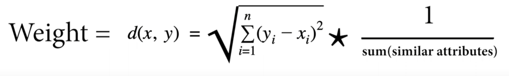

# SameSamp
Click picture for youtube video explaination:
[](https://youtu.be/ZmxhAfImc4M?si=P81RUClfE-SMy86U)

## Web Application

Introducing SameSamp, a web application that helps music producers and record labels decide if a sample is worth using in their song. Gain insights on how similar songs with the same sample performed.

### Same-Samp/client

React client side

To test client side follow these steps:

1. Open a terminal or command prompt.
2. Navigate to the `Same-Samp/client` directory.
3. Run the following command to install the required dependencies:

    ```bash
    npm install
    ```

4. Once the installation is complete, start the development server by running the following command:

    ```bash
    npm start
    ```

    This will start the React app and open it in your default browser.

5. You can now access the React app at `http://localhost:3000` in your browser.

Make sure you have Node.js and npm installed on your system before running the above commands.


### Same-Samp/Backend

The backend is built with Flask, a Python web framework. The server receives requests to generate a new graph and creates a new graph object. It then runs the selected algorithm on the graph to determine the most similar songs. The results are displayed, providing users with a list of songs that are deemed similar. 

To test client side follow these steps:
1. Open a terminal or command prompt *If you want to run with client make sure to open a NEW terminal*.
2. Navigate to the `Same-Samp/client` directory.

    ```bash
    cd Same-Samp/Backend
    ```
4. Start the server with this command
    ```bash
    python server.py
    ```

#### Graph Class

The Graph class in the Same-Samp/Backend directory is responsible for representing the graph structure. It provides methods for adding vertices, adding edges between vertices, and other operations on the graph. Additionally in the graph are the two algorithms: Djikstra's and BFS which can be called after instatiated a graph based of the sample selection. The edges of the graph are made by the following calculation below


## Dataset

The dataset used in this project was made by combining data scraped from [WhoSampled's](https://www.whosampled.com/) top sampled songs list and the spotify API. After scraping all of the songs that used the top 20 most popular samples, the data was used to call [Spotify's API](https://developer.spotify.com/documentation/web-api) to get different metrics about the songs. In total, there are around 75k songs. 

| Artist              | SongName                      | SpotifyID           | Genre                    | Year | Popularity | Duration (ms) | Explicit | Avail_Markets    | PlayCount | GrossRev | Age | annualRev |
|---------------------|-------------------------------|---------------------|--------------------------|------|------------|---------------|----------|------------------|-----------|----------|-----|-----------|
| N.W.A.              | Straight Outta Compton        | 6...W | Hip-Hop / Rap / R&B      | 1988 | 74         | 258687        | True     | ['AR'...]        | 4922929   | 9845     | 35  | 12300.625  |
| Tyler, The Creator  | Pigs                          | 5...J | Hip-Hop / Rap / R&B      | 2013 | 54         | 254733        | True     | ['AR', US ...]   | 8325632   | 16651    | 10  | 2081.375  |
| Skrillex            | Scary Monsters and Nice Sprites| 4...0 | Electronic / Dance       | 2011 | 61         | 243353        | False    | ['AT', US', ...] | 6751477   | 13502    | 12  | 1687.75   |

## Spotify Data Collector

Calls the spotify API and then iterates over the list of songs scraped from WhoSampled to gather more attributes about the songs such as popularity, playcount and available markets.

## Data Cleaner

The data cleaner is responsible for preprocessing and cleaning the collected data. This step involves tasks such as removing duplicates, handling missing values, normalizing data, and transforming it into a suitable format for further analysis.

## Random Forest Regression Model (Work In Progress)

This is a regression model that is using both numerical and categorical values to predict the revenue of a new song that was inputted into the graph. The categorical values are:
1. **Genre:** This represents the genre of the songs that sampled other songs. For example, hip-hop is notorious for sampling other older funk / soul songs.
2. **Instrument:** This indicates the type of instrument sampled from the original song. This is important because, for example, vocal samples can be more expensive to clear but can also make a song significantly more successful.


### Setting up the Environment

To run the notebook, you will need to install Conda, create a Conda environment, and install Jupyter Notebook. Please follow the steps below:

#### Step 1: Install Conda

First, you need to install Conda if you haven't already. You can choose between Anaconda and Miniconda. Anaconda includes a lot of the data science packages along with Conda, while Miniconda includes only Conda and Python and generally considered when dealing with systems that have limited resources.

- **install Anaconda**,  [Anaconda Downloads](https://www.anaconda.com/products/individual)
- **install Miniconda**, [Miniconda Downloads](https://docs.conda.io/en/latest/miniconda.html)

#### Step 2: Create a Conda Environment

After installing Conda, you can create a Conda environment using the terminal (on Linux or macOS) or Anaconda Prompt (on Windows). Replace `myenv` with your preferred name for the environment.

```bash
conda create --name myenv
```

```bash
conda activate myenv
```

#### Step 3: Install Jupyter Notebook

```bash
conda install jupyter
```

#### Step 4: Navigate to Regression Folder
From the base Sampe Samp Folder

```bash
cd ./Regression
```
Once you are in the Regression folder run this command:
```bash
jupyter notebook
```

After your browser should open the notebook where you can run it. Additionally you may need to install the packages used in the notebook. 

Generally that process goes like:
```bash
conda install package_name
```
But it is best practice to look up how the package is installed in conda as it can occasionally vary from the package name
